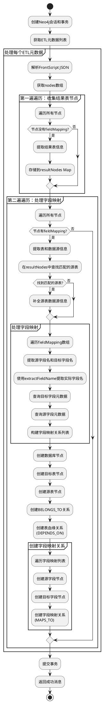
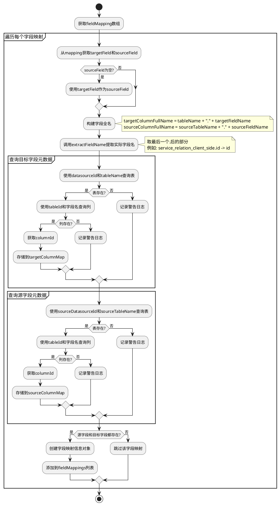
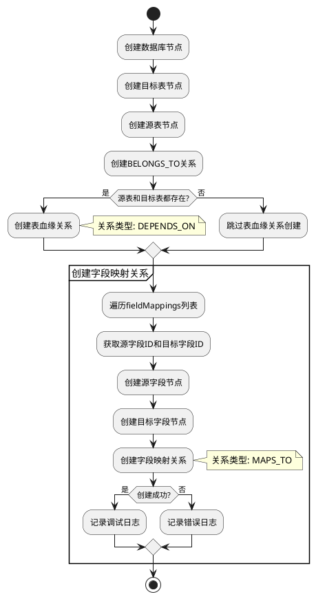
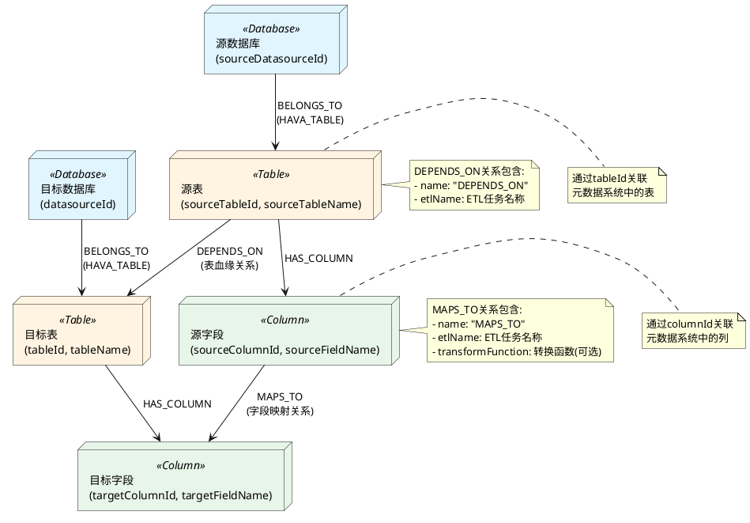

# ETL血缘关系增强功能优化总结

## 1. 功能概述

本次优化主要解决了ETL血缘关系初始化功能中缺失的两个核心关系：
- **表之间的血缘关系**（Table → Table）
- **字段之间的映射关系**（Column → Column）

通过完善这两个关系的获取和存储，实现了完整的ETL血缘关系图谱构建。

## 2. 问题分析

### 2.1 原有问题

1. **缺失表血缘关系**：虽然创建了源表和目标表节点，但没有建立它们之间的血缘关系
2. **缺失字段映射关系**：虽然创建了源字段和目标字段节点，但没有建立它们之间的映射关系
3. **字段名提取逻辑混乱**：无法正确处理中间表场景（如 `service_relation_client_side.id`）
4. **代码逻辑复杂**：字段映射处理逻辑混乱，`columnNames` 和 `sourceColumnNames` 使用反向

### 2.2 影响

- 无法查询表之间的依赖关系
- 无法追踪字段级别的数据流转
- 血缘关系图谱不完整
- 代码维护困难

## 3. 优化方案

### 3.1 关系类型设计

#### 表血缘关系（DEPENDS_ON）
- **关系类型**：`DEPENDS_ON`
- **方向**：源表 → 目标表
- **属性**：`name`、`etlName`

#### 字段映射关系（MAPS_TO）
- **关系类型**：`MAPS_TO`
- **方向**：源字段 → 目标字段
- **属性**：`name`、`etlName`、`transformFunction`

### 3.2 字段名提取优化

新增 `extractFieldName` 方法，统一处理字段名提取：
- 支持中间表：`service_relation_client_side.id` → `id`
- 支持普通表：`table.column` → `column`
- 支持无点号：`simple_column` → `simple_column`

## 4. 实现流程

### 4.1 整体流程图



### 4.2 字段映射处理详细流程



### 4.3 关系创建流程



### 4.4 数据模型关系图



## 5. 核心代码实现

### 5.1 字段名提取方法

```java
/**
 * 从字段全名中提取实际字段名
 * 字段全名格式：表名.字段名 或 中间表名.字段名
 * 例如：service_relation_client_side.id -> id
 *      table.column -> column
 *      simple_column -> simple_column
 */
private String extractFieldName(String columnFullName) {
    if (columnFullName == null || columnFullName.isEmpty()) {
        return columnFullName;
    }
    // 取最后一个.后的部分作为字段名
    int lastDotIndex = columnFullName.lastIndexOf('.');
    if (lastDotIndex != -1 && lastDotIndex < columnFullName.length() - 1) {
        return columnFullName.substring(lastDotIndex + 1);
    }
    // 如果没有.，则返回原字符串
    return columnFullName;
}
```

### 5.2 表血缘关系创建

```java
// 创建表血缘关系：源表 -> 目标表
if (sourceTableNode != null && tableNode != null) {
    try {
        dataStorage.createTableLineageRelationship(tx, sourceTableNode, tableNode,
                etlMetadataEntity.getName());
    } catch (Exception e) {
        logger.error("创建表血缘关系失败", e);
    }
}
```

### 5.3 字段映射关系创建

```java
// 创建字段映射关系：源字段 -> 目标字段
for (Map<String, Object> fieldMappingInfo : fieldMappings) {
    try {
        String sourceColumnFullName = (String) fieldMappingInfo.get("sourceColumnFullName");
        Long sourceColumnId = (Long) fieldMappingInfo.get("sourceColumnId");
        String targetColumnFullName = (String) fieldMappingInfo.get("targetColumnFullName");
        Long targetColumnId = (Long) fieldMappingInfo.get("targetColumnId");
        String transformFunction = (String) fieldMappingInfo.get("transformFunction");

        // 创建源字段节点和目标字段节点
        Node sourceColumnNode = dataStorage.createColumnNode(tx, sourceColumnId, sourceColumnFullName);
        Node targetColumnNode = dataStorage.createColumnNode(tx, targetColumnId, targetColumnFullName);

        // 创建字段映射关系
        dataStorage.createColumnMappingRelationship(tx, sourceColumnNode, targetColumnNode,
                etlMetadataEntity.getName(), transformFunction);
    } catch (Exception e) {
        logger.error("创建字段映射关系失败", e);
    }
}
```

## 6. 优化效果

### 6.1 功能完善

✅ **表血缘关系**：完整记录源表到目标表的依赖关系  
✅ **字段映射关系**：完整记录源字段到目标字段的映射关系  
✅ **中间表支持**：正确处理包含多个点的字段名  
✅ **错误处理**：单个字段失败不影响整体流程  

### 6.2 代码质量提升

✅ **逻辑清晰**：明确区分源表和目标表、源字段和目标字段  
✅ **易于维护**：统一的字段名提取方法，避免重复代码  
✅ **可追溯性**：完整的字段映射信息，便于后续查询和调试  
✅ **日志完善**：详细的日志记录，便于问题排查  

### 6.3 数据查询能力

现在可以使用以下Cypher查询：

```cypher
// 查询表血缘关系
MATCH (source:Table)-[:DEPENDS_ON]->(target:Table {id: $tableId})
RETURN source

// 查询字段映射关系
MATCH (source:Column)-[:MAPS_TO]->(target:Column {id: $columnId})
RETURN source

// 查询完整的血缘链路
MATCH path = (source:Table)-[:DEPENDS_ON*]->(target:Table {id: $tableId})
RETURN path

// 查询字段级别的完整映射链路
MATCH path = (source:Column)-[:MAPS_TO*]->(target:Column {id: $columnId})
RETURN path
```

## 7. 技术要点

### 7.1 字段名提取策略

- **问题**：中间表字段名包含多个点（如 `service_relation_client_side.id`）
- **解决**：使用 `lastIndexOf('.')` 取最后一个点后的部分
- **优势**：统一处理各种场景，代码简洁

### 7.2 关系创建策略

- **幂等性**：使用 `MERGE` 确保关系唯一，避免重复创建
- **属性存储**：在关系上存储ETL任务名称和转换函数信息
- **错误隔离**：单个关系创建失败不影响其他关系

### 7.3 数据一致性

- **ID一致性**：Neo4j节点ID与元数据系统ID保持一致
- **关联查询**：通过ID可以直接关联到元数据系统
- **完整性检查**：确保源表和目标表、源字段和目标字段都存在才创建关系

## 8. 后续优化方向

1. **血缘关系更新**：支持ETL定义变更时更新血缘关系
2. **血缘关系删除**：支持ETL任务删除时清理相关血缘关系
3. **血缘关系版本管理**：记录血缘关系的变更历史
4. **血缘关系可视化**：提供图形化界面展示表血缘和字段映射关系
5. **性能优化**：对于大量ETL任务，考虑批量处理和异步处理

## 9. 总结

本次优化完善了ETL血缘关系的核心功能，实现了表级别和字段级别的完整血缘关系追踪。通过清晰的代码逻辑和完善的错误处理，提升了系统的稳定性和可维护性。同时，通过PlantUML流程图清晰地展示了整个处理流程，便于后续的维护和扩展。

