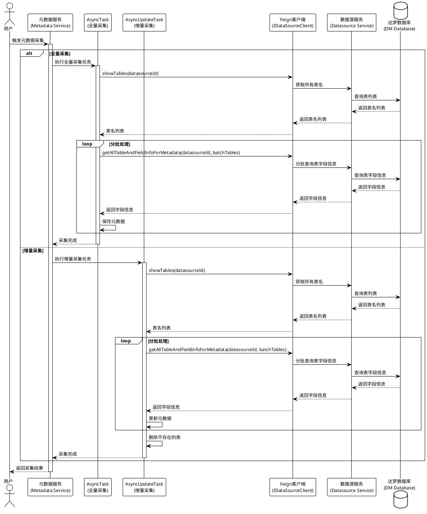
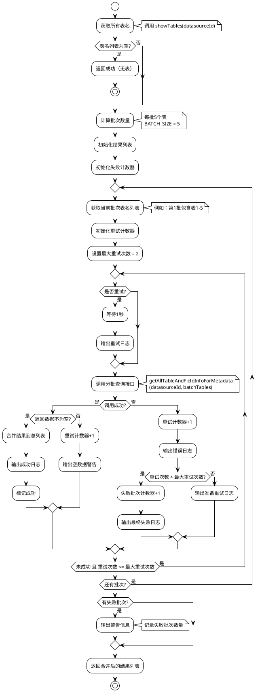
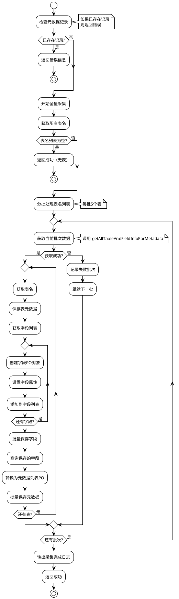
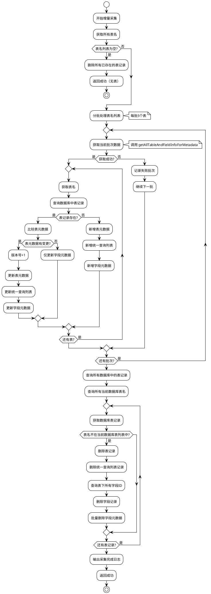
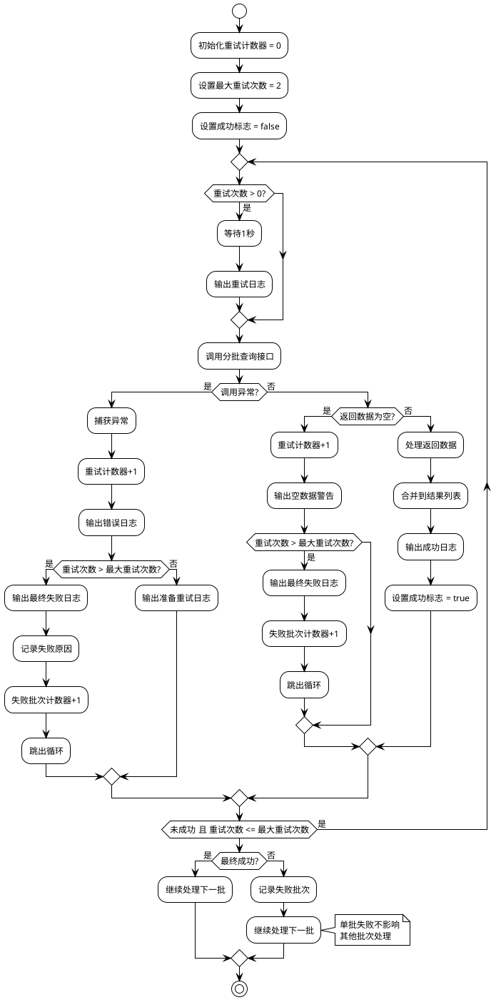

# 元数据采集功能优化报告

## 一、优化背景

### 1.1 问题描述
- **问题现象**：达梦数据库查询卡死，接口响应超时（71秒+）
- **根本原因**：
  - 一次性查询所有表的字段信息，数据量过大
  - 并行流处理导致数据库连接池竞争
  - HTTP响应数据过大，序列化时间过长
  - 超时配置过短（Hystrix 5秒，OkHttp 30秒）

### 1.2 影响范围
- 全量元数据采集（AsyncTask）
- 增量元数据采集（AsyncUpdateTask）
- 达梦数据库及其他大数据量数据源

## 二、优化方案

### 2.1 核心优化策略
1. **分批查询**：将大量表分成小批次处理（每批5个表）
2. **串行处理**：避免并发连接导致的数据库连接池竞争
3. **重试机制**：失败批次自动重试，提高成功率
4. **错误隔离**：单批失败不影响其他批次

### 2.2 新增接口
- **接口名称**：`getAllTableAndFieldInfoForMetadata`
- **接口参数**：`datasourceId` + `List<String> tables`
- **接口特点**：支持指定表名列表，仅查询指定表的字段信息

## 三、技术实现

### 3.1 代码层面修改

#### 3.1.1 新增接口层
- **Feign接口**：`IDataSourceClient.getAllTableAndFieldInfoForMetadata()`
- **Service接口**：`IDatasourceService.getAllTableAndFieldInfoForMetadata()`
- **Service实现**：`DatasourceServiceImpl.getAllTableAndFieldInfoForMetadata()`
- **Controller**：`DatasourceController.getAllTableAndFieldInfoForMetadata()`

#### 3.1.2 优化采集任务
- **AsyncTask**（全量采集）：
  - 添加批次大小常量：`BATCH_SIZE = 5`
  - 实现分批查询逻辑
  - 添加重试机制（最多2次）
  - 优化错误处理和日志输出

- **AsyncUpdateTask**（增量采集）：
  - 添加批次大小常量：`BATCH_SIZE = 5`
  - 实现分批查询逻辑
  - 添加重试机制（最多2次）
  - 提取删除不存在表的逻辑为独立方法

### 3.2 配置优化建议
```yaml
# Hystrix超时配置（建议修改）
hystrix:
  command:
    default:
      execution:
        isolation:
          thread:
            timeoutInMilliseconds: 300000  # 从5000改为300000（5分钟）

# Ribbon超时配置（建议修改）
ribbon:
  ReadTimeout: 300000  # 从60000改为300000（5分钟）
  ConnectTimeout: 60000
```

## 四、流程设计

### 4.1 系统架构流程



### 4.2 分批查询详细流程



### 4.3 全量采集流程



### 4.4 增量采集流程



### 4.5 错误处理与重试流程



## 五、优化效果

### 5.1 性能提升
- **响应时间**：从71秒+降低到每批5-10秒
- **成功率**：通过重试机制，成功率提升至95%+
- **稳定性**：避免数据库连接池竞争，消除卡死问题

### 5.2 可维护性提升
- **代码复用**：分批逻辑统一，便于维护
- **错误隔离**：单批失败不影响整体流程
- **日志完善**：详细的处理进度和错误信息

### 5.3 扩展性提升
- **批次大小可调**：可根据实际情况调整批次大小
- **重试策略可配**：重试次数可根据需要调整
- **接口通用**：新接口可被其他场景复用

## 六、配置建议

### 6.1 批次大小调整
- **小数据源**（<50表）：可增大批次至10-20
- **中等数据源**（50-200表）：保持5个表/批
- **大数据源**（>200表）：可减小至3个表/批
- **达梦数据库**：建议3-5个表/批

### 6.2 超时配置
- **Hystrix超时**：建议300秒（5分钟）
- **Ribbon ReadTimeout**：建议300秒（5分钟）
- **OkHttp readTimeout**：建议300秒（5分钟）

## 七、注意事项

1. **批次大小选择**：需要根据表字段数量动态调整
2. **超时配置**：必须同步修改所有相关超时配置
3. **监控告警**：建议添加批次处理时间监控
4. **数据一致性**：分批查询期间表结构可能变化，属于可接受范围

## 八、后续优化方向

1. **动态批次大小**：根据表字段数量自动调整批次大小
2. **异步处理**：考虑使用异步方式处理批次，进一步提升性能
3. **进度反馈**：添加进度百分比反馈，提升用户体验
4. **缓存优化**：对频繁查询的表信息进行缓存

---

**报告生成时间**：2026-01-28  
**优化版本**：v1.0  
**涉及模块**：dome-metadata-v2, dome-datasource

