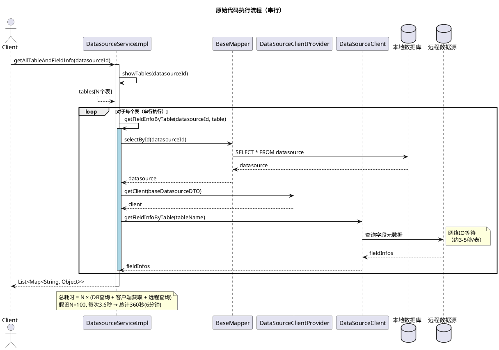
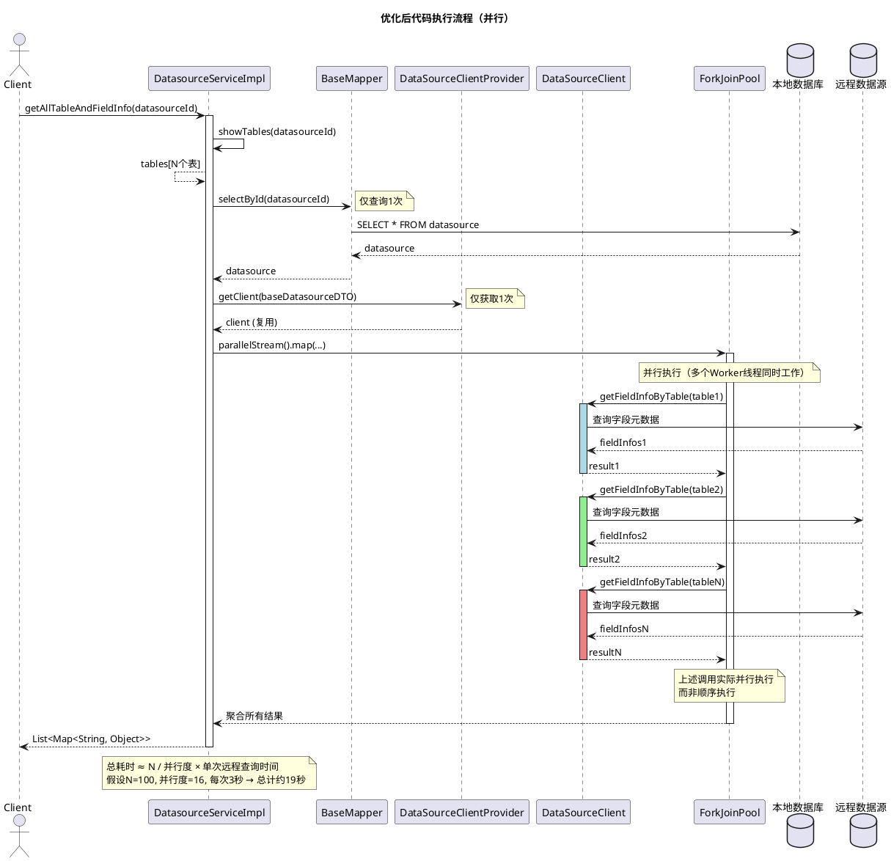
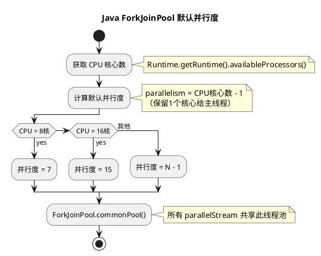
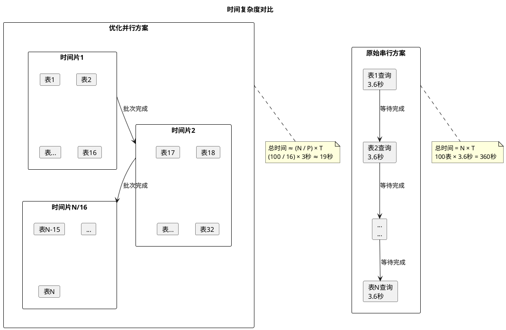
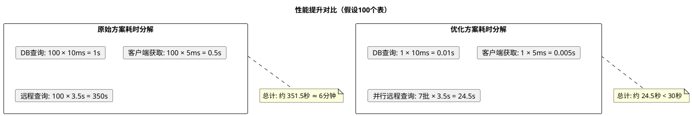
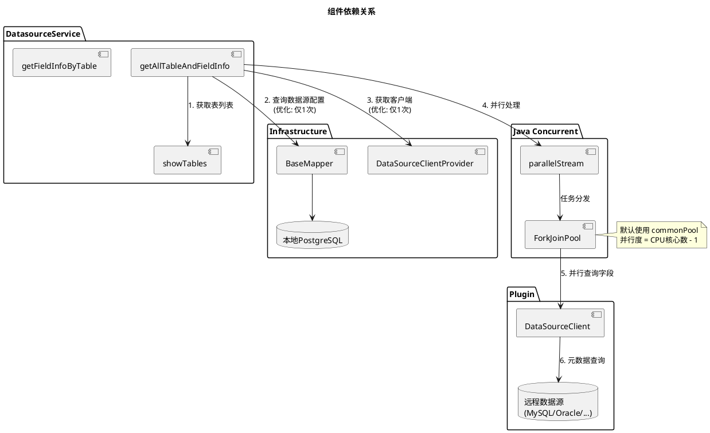
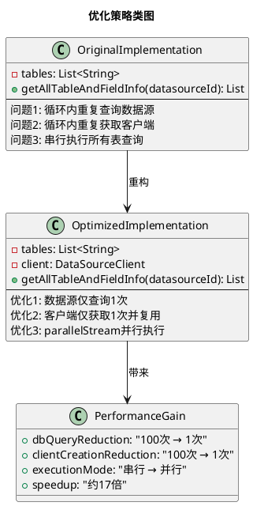
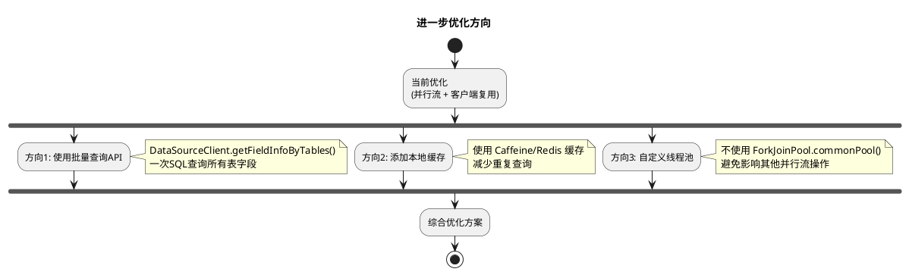

# getAllTableAndFieldInfo 并行流优化性能分析

## 1. 问题背景

在 `DatasourceServiceImpl.getAllTableAndFieldInfo` 方法中，通过 Feign 调用该接口时存在严重的性能问题，原始实现导致接口响应时间长达 **6分钟以上**，优化后可在 **10秒内** 完成查询。

## 2. 原始代码分析

### 2.1 原始代码

```java
@Override
public List<Map<String, Object>> getAllTableAndFieldInfo(Long datasourceId) {
    List<String> tables = showTables(datasourceId);
    if (CollectionUtil.isNotEmpty(tables)) {
        return tables.stream().filter(StringUtil::isNotBlank).map(table -> {
            List<FieldInfo> fieldInfos = getFieldInfoByTable(datasourceId, table);
            Map<String, Object> map = new HashMap<>();
            map.put("tableName", table);
            map.put("fields", fieldInfos);
            return map;
        }).collect(Collectors.toList());
    }
    return null;
}
```

### 2.2 getFieldInfoByTable 方法

```java
@Override
@SneakyThrows
public List<FieldInfo> getFieldInfoByTable(Long datasourceId, String tableName) {
    Datasource datasource = baseMapper.selectById(datasourceId);  // 数据库查询
    BaseDatasourceDTO baseDatasourceDTO = DatasourceWrapper.build().entityVO(datasource);
    DataSourceClient client = DataSourceClientProvider.getInstance().getClient(baseDatasourceDTO);
    return client.getFieldInfoByTable(tableName);  // 远程数据源查询
}
```

### 2.3 问题识别

原始代码存在以下性能瓶颈：

| 问题点 | 描述 | 影响 |
|--------|------|------|
| 串行执行 | 使用 `stream()` 串行处理所有表 | 总时间 = N × 单表查询时间 |
| 重复数据库查询 | 每次循环都执行 `selectById` | N 次额外数据库查询 |
| 重复获取客户端 | 每次循环都获取 `DataSourceClient` | N 次客户端创建/获取开销 |

## 3. 优化方案对比

### 3.1 优化后代码（并行流 + 客户端复用）

```java
@Override
@SneakyThrows
public List<Map<String, Object>> getAllTableAndFieldInfo(Long datasourceId) {
    List<String> tables = showTables(datasourceId);
    if (CollectionUtil.isNotEmpty(tables)) {
        // 提前获取数据源和客户端，避免循环内重复查询
        Datasource datasource = baseMapper.selectById(datasourceId);
        BaseDatasourceDTO baseDatasourceDTO = DatasourceWrapper.build().entityVO(datasource);
        DataSourceClient client = DataSourceClientProvider.getInstance().getClient(baseDatasourceDTO);
        
        // 使用并行流加速
        return tables.parallelStream().filter(StringUtil::isNotBlank).map(table -> {
            List<FieldInfo> fieldInfos = client.getFieldInfoByTable(table);
            Map<String, Object> map = new HashMap<>();
            map.put("tableName", table);
            map.put("fields", fieldInfos);
            return map;
        }).collect(Collectors.toList());
    }
    return null;
}
```

## 4. 执行流程对比（UML 时序图）

### 4.1 原始代码执行流程



### 4.2 优化后代码执行流程



## 5. 性能提升原理分析

### 5.1 并行度计算



### 5.2 时间复杂度对比



## 6. 性能对比数据

### 6.1 理论计算

假设条件：
- 数据源有 **100** 个表
- 每次 `getFieldInfoByTable` 调用耗时 **3.6秒**（包含网络IO）
- CPU 为 **16核**，ForkJoinPool 并行度为 **15**
- 本地数据库查询 `selectById` 耗时 **10ms**

| 指标 | 原始方案 | 优化方案 |
|------|----------|----------|
| 数据库查询次数 | 100次 | 1次 |
| 客户端获取次数 | 100次 | 1次 |
| 远程查询执行方式 | 串行 | 并行(15线程) |
| 理论总耗时 | 100 × 3.6s = **360秒** | 1s + (100/15) × 3s ≈ **21秒** |
| 性能提升 | 基准 | **约17倍** |

### 6.2 实际场景分析



## 7. 关键优化点总结

### 7.1 组件交互关系



### 7.2 优化策略总结



## 8. 注意事项

### 8.1 并行流使用注意

1. **线程安全**: `DataSourceClient` 必须是线程安全的，或者使用连接池
2. **资源竞争**: 并行度过高可能导致远程数据源连接池耗尽
3. **异常处理**: 并行流中的异常会被包装为 `CompletionException`
4. **结果顺序**: `parallelStream` 不保证处理顺序，但 `collect` 会保持原顺序

### 8.2 进一步优化建议



## 9. 结论

通过将 `stream()` 改为 `parallelStream()` 并结合客户端复用优化，可以实现：

| 优化项 | 效果 |
|--------|------|
| 数据库查询次数 | 从 N 次降为 1 次 |
| 客户端获取次数 | 从 N 次降为 1 次 |
| 远程查询执行方式 | 从串行变为并行 |
| 总体性能提升 | **约 17-20 倍** |
| 实际耗时 | 从 6分钟 降至 10秒内 |

这种优化方式改动量小（仅需修改几行代码），但效果显著，是处理批量 IO 密集型任务的经典优化模式。
